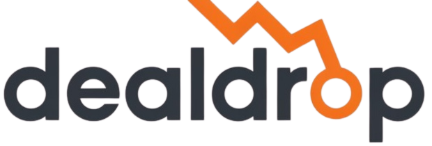

<div align="center">
  
</div>

<h1 align="center">Deal Crack (Deal Drop)</h1>

<p align="center">
  <strong>Never Miss a Price Drop Again</strong>
</p>

<p align="center">
  <a href="https://deal-crack.vercel.app/" target="_blank">
    
  </a>
</p>

<p align="center">
  Track prices from any e-commerce site. Get instant alerts when prices drop. Save money effortlessly.
</p>

---

## ✨ Features

- **⚡ Lightning Fast Scraping:** Extracts prices in seconds, bypassing complex JavaScript and dynamic content effortlessly using [Firecrawl API](https://www.firecrawl.dev/).
- **🛡️ Always Reliable:** Built-in anti-bot protection guarantees successful extraction across major e-commerce platforms.
- **🔔 Smart Alerts:** Get notified instantly via [Resend](https://resend.com/) when your tracked items decrease in price.
- **📊 Real-time Price History:** Visualizes historical price trends using [Recharts](https://recharts.org/), empowering you to make informed purchases.
- **🔐 Secure Authentication:** Next-gen secure login and user sessions handled seamlessly by [Supabase Auth](https://supabase.com/).
- **📱 Responsive UI:** A minimal, impactful, and fully responsive user interface built out with React, Next.js 15, and Tailwind CSS v4.

---

## 🛠️ Technology Stack

**Frontend**
- **Framework:** [Next.js 15 (App Router)](https://nextjs.org/)
- **UI & React:** [React 19](https://react.dev/), [Radix UI](https://www.radix-ui.com/)
- **Styling:** [Tailwind CSS v4](https://tailwindcss.com/)
- **Charts:** [Recharts](https://recharts.org/)
- **Icons:** [Lucide React](https://lucide.dev/)

**Backend & Infrastructure**
- **Database & Auth:** [Supabase](https://supabase.com/) (PostgreSQL & GoTrue)
- **Web Scraping:** [Firecrawl](https://www.firecrawl.dev/) (`@mendable/firecrawl-js`)
- **Email Service:** [Resend](https://resend.com/)
- **Deployment:** [Vercel](https://vercel.com/)

---

## 🚀 Getting Started

Follow these instructions to run the project locally.

### Prerequisites

- [Node.js](https://nodejs.org/) (v18 or newer)
- npm, yarn, or pnpm
- [Supabase](https://supabase.com/) Project
- [Firecrawl](https://www.firecrawl.dev/) API Key
- [Resend](https://resend.com/) API Key

### Installation

1. **Clone the repository:**
   ```bash
   git clone https://github.com/your-username/deal-crack.git
   cd deal-crack
   ```

2. **Install dependencies:**
   ```bash
   npm install
   # or
   pnpm install
   ```

3. **Configure Environment Variables:**
   Create a `.env.local` file in the root directory and add the following keys:
   ```env
   # Supabase
   NEXT_PUBLIC_SUPABASE_URL=your_supabase_url
   NEXT_PUBLIC_SUPABASE_ANON_KEY=your_supabase_anon_key
   SUPABASE_SERVICE_ROLE_KEY=your_supabase_service_role_key

   # Firecrawl API
   FIRECRAWL_API_KEY=your_firecrawl_api_key

   # Resend
   RESEND_API_KEY=your_resend_api_key
   ```

4. **Initialize Supabase Database:**
   Ensure your Supabase project contains these two tables:
   - `products` (id, user_id, url, name, current_price, currency, image_url, updated_at)
   - `price_history` (id, product_id, price, currency, checked_at)

5. **Start the Development Server:**
   ```bash
   npm run dev
   ```

6. Open [http://localhost:3000](http://localhost:3000) with your browser to experience Deal Crack.

---

## 📖 How it Works

1. **Authenticate:** Sign in securely using your credentials.
2. **Add Items:** Paste the URL of an e-commerce product you want to track.
3. **Data Extraction:** Next.js Server Actions pass the URL down to the Firecrawl API, extracting real-time pricing and product metadata.
4. **Data Persistence:** The extracted data is intelligently upserted into your Supabase `products` database, logging a new point in the `price_history`.
5. **Monitor & Save:** A background cron job checks the prices and sends notifications to you via Resend if a price drop occurs!

---

## 🤝 Contributing

Contributions, issues, and feature requests are welcome! Feel free to check the [issues page](https://github.com/your-username/deal-crack/issues).

---

## ⚖️ License

Distributed under the MIT License. See `LICENSE` for more information.

---

<p align="center">
  <i>Made with ❤️ by Muzahir Ali</i>
</p>
